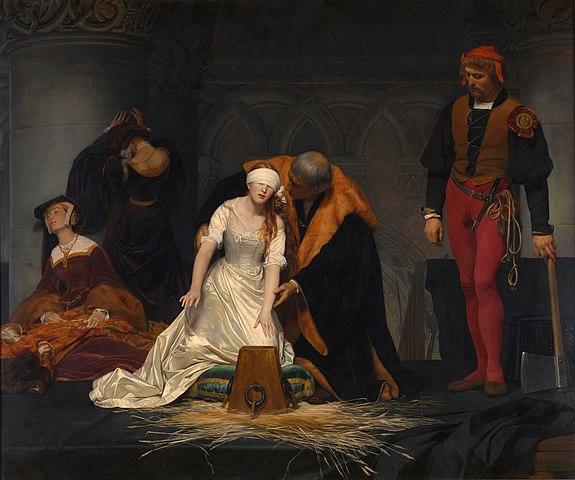

👋 I am a graduate of the London School of Economics and Political Science, in Social Research Methods. My background includes a Bachelor of Social Science in Political Science and Government from the Pontifical Catholic University of Peru.

    
    
Painting of the week: The Execution of Lady Jane Grey (1833)

🔍 Currently, I am a Research Assistant at the Care Policy and Evaluation Centre, LSE, and Researcher at the [Observatorio de Reformas Políticas en América Latina](https://www.reformaspolíticas.org). My research focus on political parties, electoral reforms, and elections in Latin America. 📊 My interests extend to quantitative studies, coding, data visualization using R, and my teaching experience encompasses Statistics for Political Analysis at the Pontifical Catholic University of Peru and other institutions.

📚 I have also been involved directing academic journals in Latin America such as [Elecciones](https://revistas.onpe.gob.pe/index.php/elecciones) and [Politai](https://revistas.pucp.edu.pe/index.php/politai), contributing to their visibility in academic circles.

🏅 Thanks to my efforts, I have been fortunate to receive grants, scholarships, and awards recognizing my academic achievements. Notable among these are the Beca Generación Bicentenario Scholarship, the Solidarity Academic Encouragement Scholarships (BEAS), and the Colegio Mayor Secundario Presidente del Perú Scholarship. These recognitions have significantly supported my academic journey.

✨ Beyond my academic work, I hold a profound fascination for art, particularly paintings stemming from the Impressionist movement. I frequently curate and share artworks that catch my attention on my [Art Blog](https://artchronicles.tumblr.com/). ♟️Additionally, while I do not compete at a professional level, I find immense joy in playing chess and am an enthusiastic spectator of the game.
