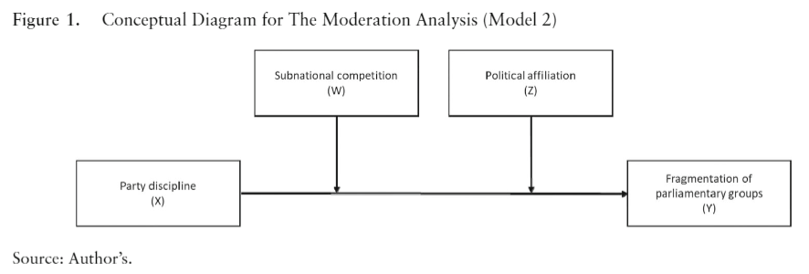
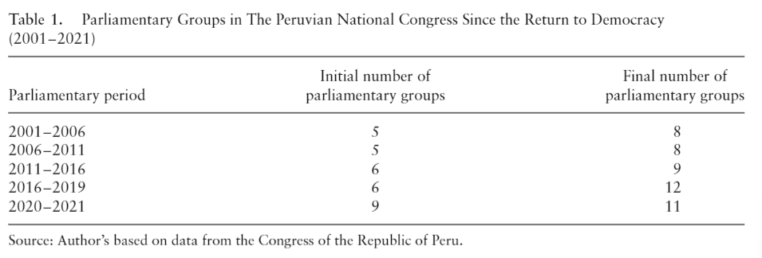
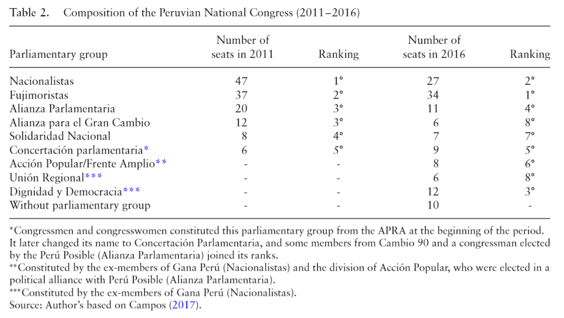
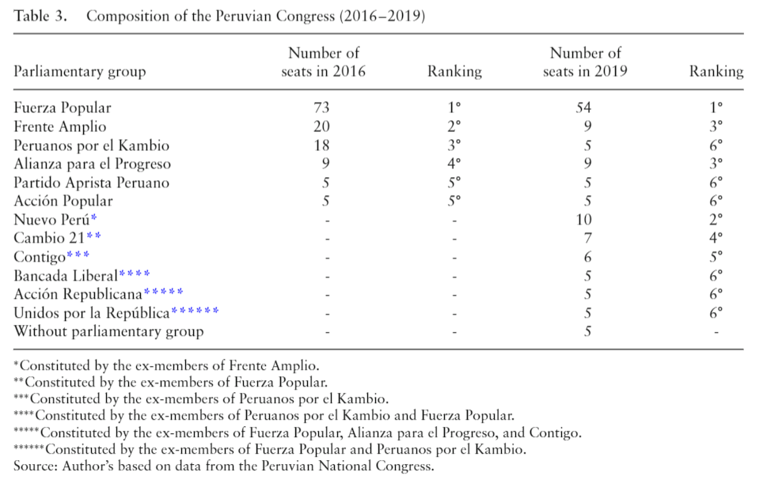
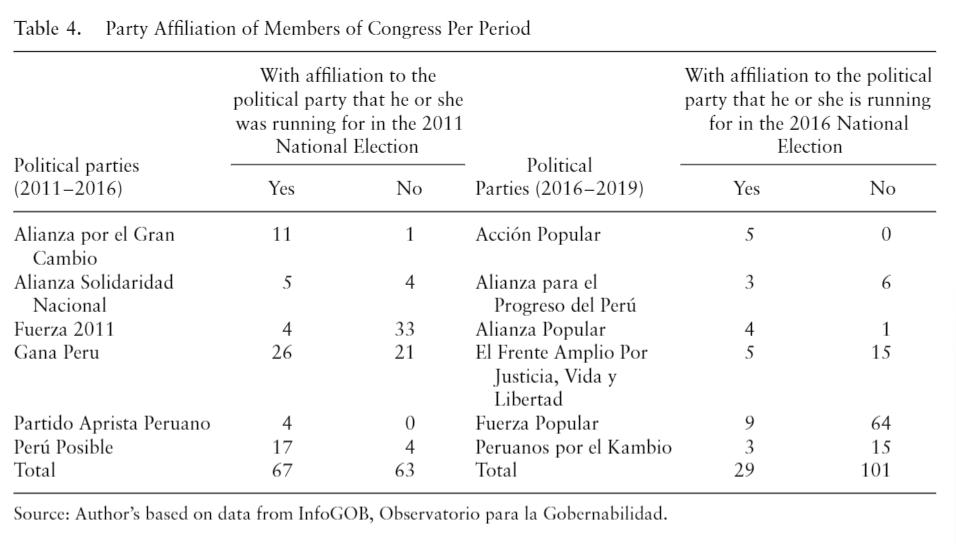
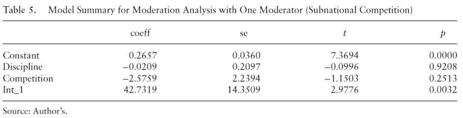
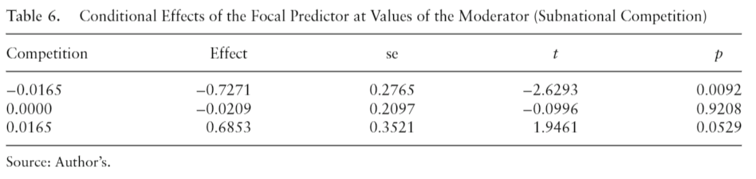
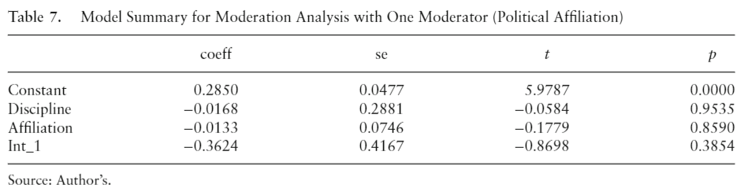
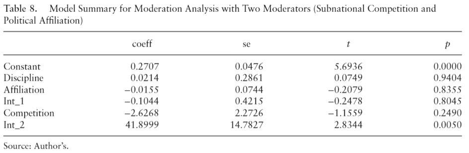
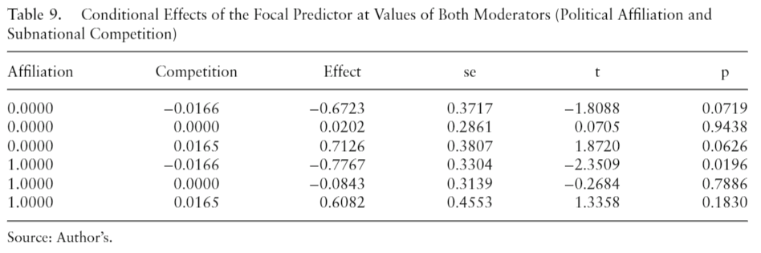

Party division in Peru is a constant event and has become an expected
feature of Peruvian parliamentary politics. For instance, in 2016, the
elected Congress was composed of six parliamentary groups, and at the
moment of its dissolution, that number doubled. This article explores
the factors that produce such rapid division in the Peruvian Congress
during two parliamentary periods (2011--2016, 2016--2019). It argues,
through quantitative analysis, that there is a direct and negative
relationship between the fragmentation of parliamentary groups and party
discipline due to party affiliation and the dynamics of subnational
party competition.

[**Download paper
here**](https://www.researchgate.net/publication/372884572_The_Impossibility_of_Party_Unity_in_Peru_Party_Affiliation_Subnational_Electoral_Competition_and_Party_Discipline_2011-2019)

**Figures & Supplementary Resources:**

