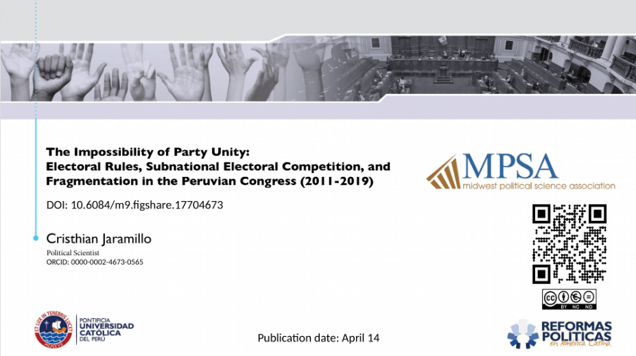

> Peru's Congress saw a doubling of parliamentary groups from six to twelve, signaling persistent division. The connection between this division and declining party discipline is attributed to factors like party affiliations and subnational competition dynamics. Exploring how these elements shape Peru's political scene, this article aims to spark discussions on the complexities of party dynamics.

Party division in Peru's parliamentary politics has been a recurring and anticipated aspect, marked by a constant flux in its composition. In 2016, the Congress comprised six parliamentary groups, which doubled in number by the time of its dissolution. This article delves into the reasons behind this rapid division within the Peruvian Congress during two specific parliamentary periods (2011--2016, 2016--2019).

Through a quantitative analysis, this study posits that the escalation in the fragmentation of parliamentary groups directly correlates with decreased party discipline. It attributes this trend to party affiliations and the intricate dynamics of subnational party competition. The research explores how these factors contribute to the shifting landscape of Peru's Congress, offering insights into the relationship between the proliferation of groups and the internal cohesion of parties. This article was crafted to spark discussions and deepen our understanding of the complexities behind party dynamics within the Peruvian political landscape.

[**Download the presentation here**](https://figshare.com/articles/presentation/The_impossibility_of_Party_Unity_Electoral_Rules_Subnational_Electoral_Competition_and_Fragmentation_in_the_Peruvian_Congress_2011-2019_/17704673)

