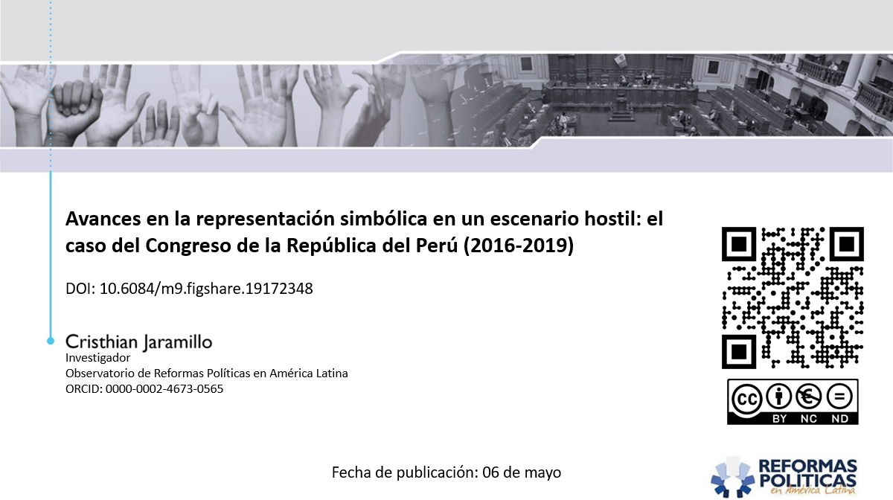

Peru acknowledged women's right to vote in 1955, yet female representation in the Congress remained minimal or absent until the 1990s. Between 1956 and 1995, the average representation of women in the Legislative branch hovered at a mere 4.82%, reaching a peak of 10.83% in 1995. Initiatives arose due to the disparities, leading to the implementation of a gender quota in 1997, mandating a 25% representation for both men and women on congressional lists. Despite its positive impact in doubling female congressional presence in 2000, attempts to increase the quota to 50% faced resistance, settling eventually at 30%. Subsequent reforms in 2019 and 2020 introduced more progressive measures, aiming for gender parity by 2031, yet swift replacement legislation in 2020 immediately enforced gender parity and alternation in subsequent General Elections. These changes significantly bolstered female representation, increasing the number of women in the Congress from 22 (18.33%) in 2000 to 49 (37.69%) in 2021, marking a notable 19.36% rise in women-held seats.

Despite these advancements, women in Peruvian politics encounter multifaceted barriers---political, institutional, economic, and social. Despite their dominance in the electoral roll and active participation in party activities, women face unequal competition. Even when elected, they often confront marginalization within the political sphere, undermined by their male counterparts. The recent electoral reforms represent substantial progress towards gender equity, yet they underline the persistent challenges women encounter in achieving substantive political influence and equal representation in Peru's political landscape. This presentation was crafted to spark discussions and deepen the understanding of the complexities behind women political participation in Peru.

[**Download the presentation here**](https://figshare.com/articles/presentation/Avances_en_la_representaci_n_simb_lica_en_un_escenario_hostil_el_caso_del_Congreso_de_la_Rep_blica_del_Per_2016-2019_/24688056)

