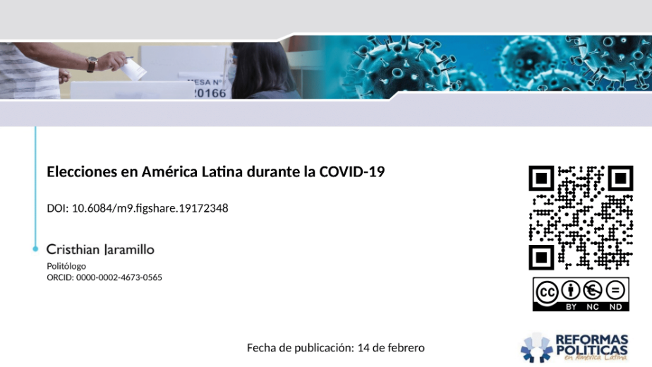

> In the midst of a global pandemic, the resilience of democratic processes faced a crucial test. Contrary to fears, elections amidst COVID-19 didn't intensify reported cases, emphasizing that safeguarding both electoral integrity and public health remains a critical balance in uncertain times.

The COVID-19 pandemic, declared a global crisis in March 2020 by the World Health Organization, prompted worldwide measures to curb its spread. Amidst its impact on health, politics, and economies, concerns arose about its effect on democratic processes, particularly elections. Elections, fundamental to democracy, necessitate physical movement and voter presence, conflicting with social distancing measures.

This study, focusing on Latin American countries' elections during the pandemic from 2020 to late 2021, aims to assess the pandemic's impact on COVID-19 cases statistically. Contrary to concerns, the research argues that holding elections during this period didn't lead to an increase in reported cases. Despite increased contact among citizens during elections, the duration of exposure didn't significantly alter the trend of COVID-19 infections. Data from Johns Hopkins University, analyzed using the Wilcoxon statistical test, supports this argument.

[**Download the presentation here**](https://figshare.com/articles/presentation/Elecciones_en_Am_rica_Latina_durante_la_COVID-19/19172348)

